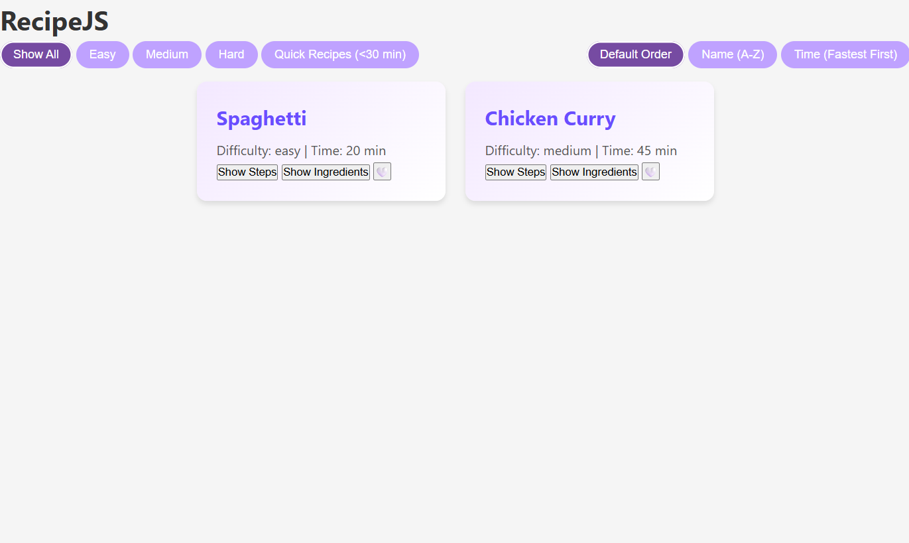

# 🍳 RecipeJS – Functional Cooking Companion

RecipeJS is an interactive recipe dashboard built using **HTML, CSS, and JavaScript**.  
It lets users search, filter, and sort recipes, view steps and ingredients, and mark favorites — all with a clean and responsive interface.

---

## 🚀 Live Demo
🔗 [View Live Project](#)  
*(Replace `#` with your Netlify / GitHub Pages / Vercel link)*

---

## 📌 Features

- 🔍 Search recipes by name or ingredients
- 🏷 Filter recipes by difficulty: Easy / Medium / Hard / Quick
- ⏱ Sort recipes by name or cooking time
- 📋 Expandable sections for steps and ingredients
- ❤️ Mark recipes as favorites (saved in localStorage)
- 📱 Responsive layout for mobile and desktop

---

## 🛠 Tech Stack

- HTML5
- CSS3 (Flexbox / Grid)
- JavaScript (ES6)
- localStorage for saving favorites

---

## 📷 Screenshots

## 📷 Screenshot



---

## ⚙️ How to Run Locally

1. Clone the repository:

```bash
git clone https://github.com/hanshika724-design/RecipeJS.git
